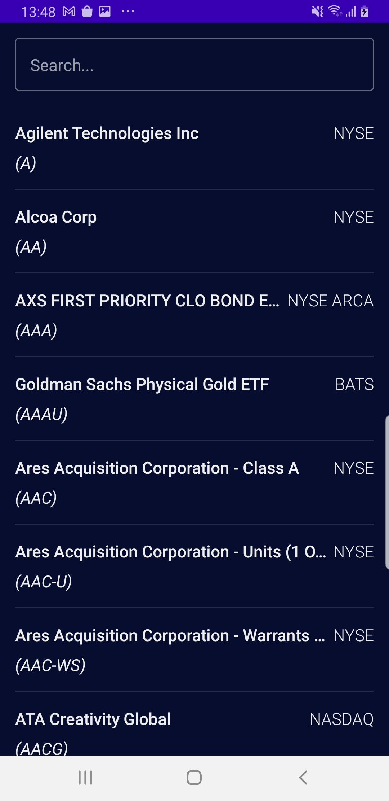
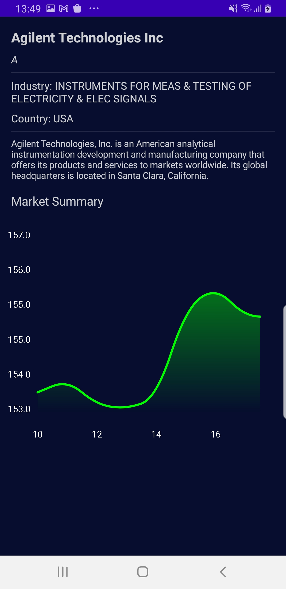

# Stock-Market
App to check the stock market

## The Brief

App that searches searches the stock market and shows company details including a stock graph

## Architecture & Libraries
    - MVI
    - Retrofit
    - ROOM Database
    - Dependency Injection - Dagger-Hilt
    - Kotlin Coroutines
    - Flow

## App preview:

Image #1            |  Image #2            
:-------------------------:|:----------------------------:
    |       
